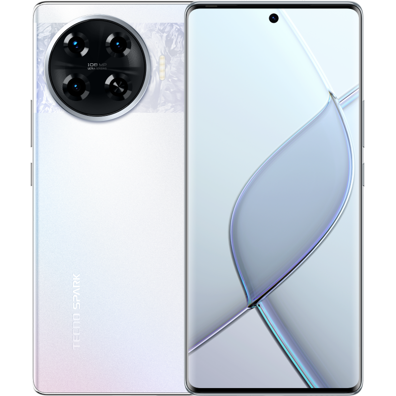

<!DOCTYPE html>
<html lang="en">
<head>
    <meta charset="UTF-8">
    <meta name="viewport" content="width=device-width, initial-scale=1.0">
    <title>Document</title>
    
    
 </head>
 <body>
    

        
        <h1>Tecno Zone</h1>
        

            <input type="search" id="search" placeholder="search..." size="30px">
            <button type="submit">Search</button>
        

    

    

        <a href="#" style="font-family: Cambria, Cochin, Georgia, Times, 'Times New Roman', serif; font-size: large; background-color: #888;" >HOME</a>
        <a href="lab7.html" style="font-family: Cambria, Cochin, Georgia, Times, 'Times New Roman', serif; font-size: large;">PRODUCTS</a>
        <a href="about.html" style="font-family: Cambria, Cochin, Georgia, Times, 'Times New Roman', serif; font-size: large;">ABOUT</a>
        <a href="#" style="font-family: Cambria, Cochin, Georgia, Times, 'Times New Roman', serif; font-size: large;">SHOP NOW!</a>
        <label for="modal-toggle" class="open-modal" style="font-family: Cambria, Cochin, Georgia, Times, 'Times New Roman', serif;  font-size: large; margin-top: 5px;">LOG-IN</label>
        <input type="checkbox" id="modal-toggle" class="modal-toggle">
   

<label for="modal-toggle" class="close">&times;</label>

<form style="color: #555555;">
    

        <h2>LOG-IN</h2>
     <input type="text" id="username" name="username" required>
    
<label for="username">username</label>

    
     <input type="password" id="password" name="password" required>
    
<label for="password">password</label>

     <button type="log-in">Log-in</button>

<a href="register.html" style="margin-left: 70%; color: black;">Register</a>
</form>

    

        

            
            
            
            
            
            
            
            
            
            

            

        

        
    
    

    
LOOKING FOR AFFORDABLE PHONE OPTIONS?
         HERE ARE SOME TOP PICKS!
    

        

            <a href="22.html">
                

                
                
 Tecno Pova 6 pro 5G

            
</a>
            <a href="1.html">
              

                
              
Tecno Pova 3

            
            
</a>
            
        
                

                  
                  
Tecno Pova 5 X Free Fire

            
            
</a>
            <a href="11.html">
              

              
              
Tecno Pova neo 3

            
            
</a>
            <a href="29.html">
              

              
              
 Tecno Pova 4 pro

            
</a>

    

 </body>
 </html>
